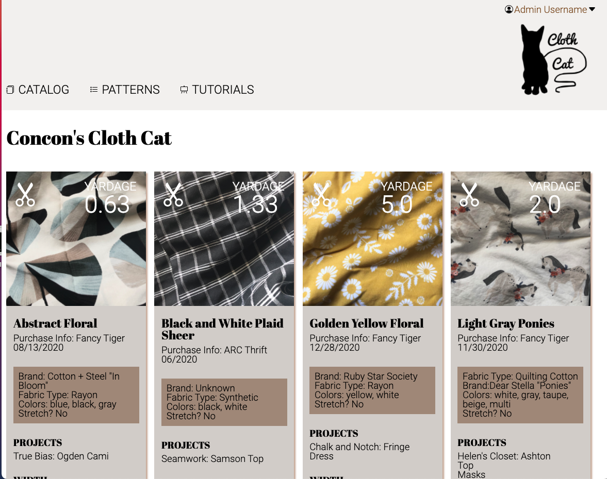

# Static Comp Challenge

# Abstract

Recreate a webpage in HTML and CSS based off of a provided static comp with limited creative license. 

# Contributors

Connie Hong

# Project Links: 

Project Spec: https://frontend.turing.io/projects/module-1/m1-static-comp

Deployed Site: https://conconartist.github.io/ch-comp-challenge-1/

# Technologies Used:

<ul>HTML</ul>
<ul>CSS</ul>
<ul>CSS reset</ul>

# Comp Comparison 

Original Static Comp:

Creative license was given in regards to responsive design, copy, color scheme, and images. I based my version of the comp on a fabric cataloging application that holds images of fabric and information on length, purchase information, colors, projects, and other pertinent info. A user may hover over icons to see the colors of the icons change.  Neutral colors were used to compliment a variety of color combinations and patterns of uploaded fabric images. 

# Responsiveness and Future Iterations

I would like to build upon this comp for functionality by creating classes to simplify the HTML and utilizing user input fields to make the application something a user can update.  Local storage and/or building out an API would be useful for the user to keep track of fabrics from one device to another and upon refresh.  
